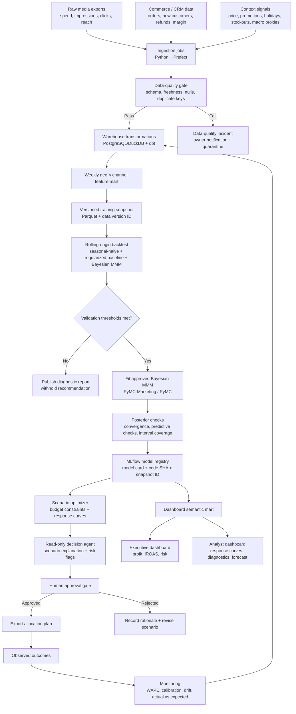
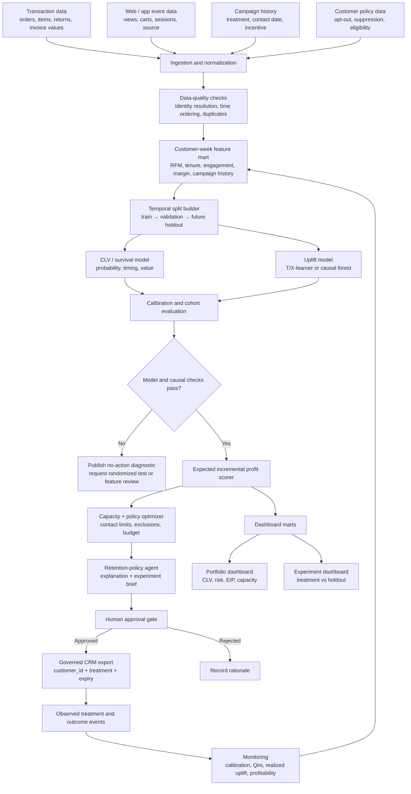
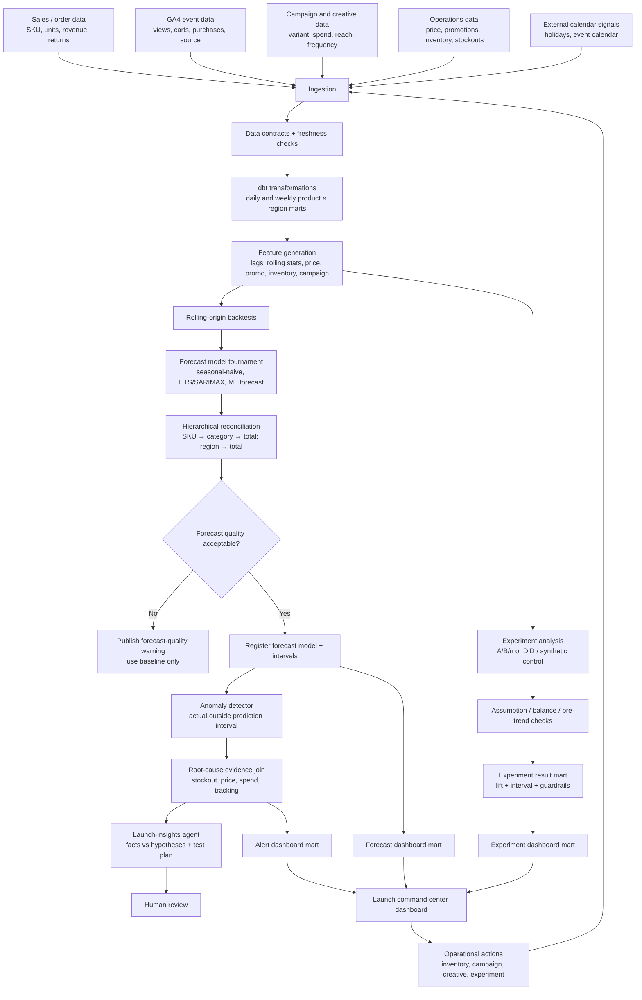

# Project 1 — Incrementality-Aware Budget Allocation and Media-Mix Forecasting Platform

## Problem statement

A multi-channel firm invests across paid search, paid social, display, affiliates, email, and brand activity. Platform-reported conversion credit can overstate a channel’s causal contribution because it frequently credits the final touch before a conversion rather than measuring what would have happened without the spend.

Build a production-style analytics system that estimates incremental commercial impact, forecasts the next 4–12 weeks, and recommends constrained budget scenarios that maximize expected contribution profit—not clicks or attributed revenue alone.

## Pseudo decision examples

> **Question 1:** “We have an additional $75,000 to deploy next month. How should it be split across paid search, paid social, display, and affiliates if the objective is incremental contribution profit?”
>
> **Question 2:** “Paid social has the largest dashboard-attributed ROAS. Does the evidence support increasing its spend, or is it already on the flat part of the response curve?”
>
> **Question 3:** “What proportion of next quarter’s $600,000 media plan is at risk of failing to clear the minimum acceptable incremental return?”

## Operational flow



## Public datasets and input strategy

A fully public project needs a transparent hybrid-data strategy because open datasets rarely contain every causal variable required for a real multi-channel allocation system. Use public behavioral/transaction data as the real foundation, then construct **clearly labeled synthetic media, geographic, margin, price, and experiment fields** through a reproducible simulator. Do not represent simulated outcomes as real firm outcomes.

| Resource                                       | Link                                                                                                | What it contains                                                                                                                 | Use in this project                                                                         | Caveat / implementation note                                                                                                                                                                                 |
| ---------------------------------------------- | --------------------------------------------------------------------------------------------------- | -------------------------------------------------------------------------------------------------------------------------------- | ------------------------------------------------------------------------------------------- | ------------------------------------------------------------------------------------------------------------------------------------------------------------------------------------------------------------ |
| Google Analytics 4 Obfuscated Sample Ecommerce | [Google documentation](https://developers.google.com/analytics/bigquery/web-ecommerce-demo-dataset) | Three months of obfuscated GA4 event-export data from the Google Merchandise Store, including user behavior and ecommerce events | Build demand, conversion, device, geography, source/medium, product, and revenue aggregates | The documented sample covers 2020-11-01 to 2021-01-31; it is too short for a robust weekly MMM alone, so use it to demonstrate ingestion/schema design or combine it with synthetic long-horizon media data. |
| Google Analytics Sample                        | [Kaggle mirror](https://www.kaggle.com/datasets/bigquery/google-analytics-sample)                   | Google Merchandise Store session, traffic-source, content, and transaction-style data                                            | Alternative source for channel/session outcome marts                                        | Inspect license, export steps, and field availability before use; retain a data-access README.                                                                                                               |
| Synthetic weekly MMM dataset                   | [Kaggle example](https://www.kaggle.com/datasets/nafees2006/mmm-dataset)                            | Simulated weekly marketing and sales signals                                                                                     | Fast local prototype for adstock, saturation, forecasting, and optimizer demonstrations     | Treat as a teaching/prototype dataset; document all assumptions and validate code with synthetic recovery tests.                                                                                             |
| PyMC-Marketing                                 | [Documentation](https://www.pymc-marketing.io/en/stable/)                                           | Open-source Bayesian MMM, CLV, adstock/saturation transforms, and budget allocation tooling                                      | Primary modeling framework                                                                  | Use its uncertainty outputs and diagnostics; do not treat a library output as causal proof without design validation.                                                                                        |
| CausalPy                                       | [Documentation](https://causalpy.readthedocs.io/en/stable/api/generated/causalpy.experiments.html)  | Difference-in-differences, synthetic control, and related quasi-experiment implementations                                       | Optional geo or market-level calibration analysis                                           | Use only after assessing pre-trends, donor pool, and design assumptions.                                                                                                                                     |

### Reproducible augmentation plan

1. Aggregate public event/transaction data to `week × region × channel` where available.
2. Generate a 104–156-week synthetic panel with known data-generating parameters for lag, saturation, seasonality, price, promotion, and channel effects.
3. Seed the generator and publish the true parameters separately from the training data.
4. Demonstrate parameter recovery, forecast validation, and allocation behavior under both correctly specified and stress-test conditions.
5. Keep a `source_type` field with values such as `public_observed`, `synthetic_simulated`, and `derived` in every curated table.

## Data contracts and probable output datasets

### Input marts

| Table                         | Grain                     | Representative columns                                                                       | Pipeline source                                    |
| ----------------------------- | ------------------------- | -------------------------------------------------------------------------------------------- | -------------------------------------------------- |
| `fct_media_delivery_weekly`   | week × region × channel   | `week_start`, `region_id`, `channel`, `spend`, `impressions`, `clicks`, `reach`, `frequency` | Platform export or reproducible simulator          |
| `fct_commerce_weekly`         | week × region             | `orders`, `new_customers`, `gross_revenue`, `refunds`, `gross_margin_rate`, `variable_cost`  | GA4/public data plus derived economics assumptions |
| `fct_business_context_weekly` | week × region             | `price_index`, `promo_flag`, `stockout_days`, `holiday_flag`, `competitor_index_proxy`       | Derived / public calendar / simulator              |
| `fct_geo_experiment`          | geo × experiment × period | `treatment_flag`, `pre_post_flag`, `spend_delta`, `outcome_value`                            | Synthetic experiment or real test export           |

### Dashboard-ready output dataset: `mart_media_decision_weekly`

| week_start | region_id |     channel |  spend | incremental_revenue_p50 | incremental_revenue_p10 | incremental_revenue_p90 | iROAS_p50 | marginal_iROAS_p50 | contribution_profit_p50 | allocation_recommendation | recommendation_status | model_version    |
| ---------- | --------- | ----------: | -----: | ----------------------: | ----------------------: | ----------------------: | --------: | -----------------: | ----------------------: | ------------------------- | --------------------- | ---------------- |
| 2026-05-04 | south     | paid_search | 42,000 |                 121,500 |                  89,200 |                 151,400 |      2.89 |               2.11 |                  31,550 | Maintain                  | Approved              | `mmm_2026_05_01` |
| 2026-05-04 | south     | paid_social | 31,000 |                  61,300 |                  12,900 |                 105,600 |      1.98 |               0.84 |                   5,120 | Reduce by 10%             | Needs review          | `mmm_2026_05_01` |
| 2026-05-04 | south     |   affiliate | 18,000 |                  57,900 |                  41,700 |                  74,300 |      3.22 |               3.05 |                  18,070 | Increase by 15%           | Approved              | `mmm_2026_05_01` |

### Dashboard-ready output dataset: `mart_mmm_model_health`

| model_version    | evaluation_window        |  WAPE |   RMSE | interval_90_coverage | rhat_max | divergence_count | data_freshness_hours | decision_safe | note                                                                 |
| ---------------- | ------------------------ | ----: | -----: | -------------------: | -------: | ---------------: | -------------------: | ------------- | -------------------------------------------------------------------- |
| `mmm_2026_05_01` | 2026-02-02 to 2026-04-27 | 0.087 | 12,430 |                 0.88 |     1.01 |                0 |                   19 | true          | Coverage is near target; monitor paid-social coefficient uncertainty |

## Statistical model and LaTeX formulas

### Media response model

For geography $g$ and week $t$, estimate an outcome such as contribution profit or new-customer value:

$$
y_{g,t} = \alpha_g + \tau_t + \sum_{c=1}^{C} \beta_c f_c\\left(\mathrm{Adstock}(x_{g,c,t};\lambda_c)\right) + \boldsymbol{\gamma}^{\top}\mathbf{z}_{g,t} + \epsilon_{g,t}.
$$

Where:

- $x_{g,c,t}$ is spend in channel $c$.
- $\mathrm{Adstock}(\cdot)$ represents delayed or carryover impact.
- $f_c(\cdot)$ is a monotonic saturation transformation, such as a Hill curve.
- $\mathbf{z}_{g,t}$ holds context controls: price, promotion, holiday, stockout, and trend/seasonality variables.
- Posterior distributions are preserved so the dashboard can display uncertainty rather than a misleading single estimate.

A simple geometric adstock transformation is:

$$
\mathrm{Adstock}(x_t;\lambda) = \sum_{k=0}^{K}\lambda^k x_{t-k}, \qquad 0 \leq \lambda < 1.
$$

A Hill saturation function is:

$$
f(x;\alpha,\theta) = \frac{x^{\alpha}}{x^{\alpha}+\theta^{\alpha}}.
$$

### Core commercial metrics

$$
\mathrm{iROAS}_{c} = \frac{\text{Incremental Revenue}_{c}}{\mathrm{Spend}_{c}}.
$$

$$
\text{Contribution Profit} = \mathrm{Revenue}\times\text{Gross Margin Rate} - \text{Variable Costs} - \text{Media Spend}.
$$

$$
\text{Marginal iROAS}_{c} = \frac{\partial\,\mathbb{E}[\text{Incremental Revenue}]}{\partial\,\mathrm{Spend}_{c}}.
$$

$$
\mathrm{WAPE} = \frac{\sum_{t=1}^{T}|y_t-\hat{y}_t|}{\sum_{t=1}^{T}|y_t|}.
$$

### Validation protocol

- Use rolling-origin backtests rather than random train/test splits.
- Compare against seasonal-naive and regularized-regression baselines.
- Report WAPE, MAE, RMSE, and 80%/90% predictive-interval coverage.
- Run posterior-predictive checks by channel and geography.
- Compare model-estimated incremental lift with a geo holdout, matched-market, or synthetic-control analysis when possible.
- Withhold budget recommendations when diagnostics fail, spend lies outside historical support, data freshness breaches the SLA, or uncertainty is too high.

## Dashboard blueprint

### Page 1 — Executive allocation cockpit

```text
┌──────────────────────────────────────────────────────────────────────────────┐
│ Period: Next 4 weeks     Objective: Contribution profit     Model: v2026.05  │
├──────────────┬──────────────┬───────────────┬────────────────────────────────┤
│ Spend plan   │ Exp. profit  │ Portfolio     │ Budget at risk                 │
│ $600K        │ $184K        │ iROAS 2.41    │ $72K below return threshold    │
│ ▲ 2.0%       │ 80% CI       │ 80% CI        │ 12% of planned spend           │
├────────────────────────────────────┬─────────────────────────────────────────┤
│ Scenario waterfall                 │ Expected contribution profit by scenario│
│ Current → Reallocation → Guardrail │ [Range bar chart: p10 | p50 | p90]      │
│ [waterfall]                        │ Conservative / Expected / Upside        │
├────────────────────────────────────┼─────────────────────────────────────────┤
│ Channel allocation table           │ Allocation change                       │
│ Search     $210K  iROAS 2.89       │ [Horizontal diverging bars]             │
│ Social     $125K  iROAS 1.98       │ Search +$20K; Social -$32K; Affiliate…  │
│ Affiliate  $145K  iROAS 3.22       │                                         │
└────────────────────────────────────┴─────────────────────────────────────────┘
```

**Primary visual components**

| Component                          | Chart type                          | Fields                                                        | Interaction                                                |
| ---------------------------------- | ----------------------------------- | ------------------------------------------------------------- | ---------------------------------------------------------- |
| Incremental profit under scenarios | Waterfall plus uncertainty interval | current allocation, proposed allocation, p10/p50/p90 profit   | Change total budget, objective, and risk tolerance         |
| Channel response curve             | Line chart with credible band       | spend, expected incremental revenue/profit, 80%/95% interval  | Hover at current and proposed spend; show saturation point |
| Planned vs recommended allocation  | Diverging horizontal bar chart      | current spend, proposed spend, delta                          | Filter by region and planning period                       |
| Budget-at-risk                     | Treemap or heatmap                  | channel, region, spend with lower iROAS bound below threshold | Click to inspect diagnostic and holdout evidence           |
| Allocation decision log            | Audit table                         | scenario ID, model ID, approver, decision, timestamp          | Drill into full scenario assumptions                       |

### Page 2 — Analyst diagnostics and forecast view

```text
┌──────────────────────────────────────────────────────────────────────────────┐
│ Filters: region | channel | outcome | week                                   │
├────────────────────────────────────┬─────────────────────────────────────────┤
│ Actual vs forecast                 │ Forecast residual distribution          │
│ [time series: actual, p50, p10-p90]│ [histogram + 0 reference line]          │
├────────────────────────────────────┼─────────────────────────────────────────┤
│ Channel response / saturation      │ Model health                            │
│ [line + credible interval]         │ R-hat | divergences | WAPE | coverage   │
├────────────────────────────────────┴─────────────────────────────────────────┤
│ Data quality and out-of-support alerts                                       │
│ [table: week, channel, issue, severity, owner, recommended action]           │
└──────────────────────────────────────────────────────────────────────────────┘
```

**Time-series specification:** display observed outcome as a solid line; posterior median forecast as a dashed line; 80% and 95% predictive ranges as translucent bands; annotate promotions, stockouts, major spend changes, and test start/end dates.

## Agentic decision-support design

The agent is a constrained, read-only analyst that retrieves only approved datasets and registered model artifacts. It cannot spend money, modify bids, or send communications.

| Agent tool             | Input                                  | Output                              | Guardrail                                        |
| ---------------------- | -------------------------------------- | ----------------------------------- | ------------------------------------------------ |
| `get_model_health`     | `model_version`                        | diagnostics and pass/fail status    | Refuse recommendation if health is failing       |
| `simulate_allocation`  | budget, channel constraints, objective | p10/p50/p90 profit and channel plan | Reject allocations outside supported spend range |
| `get_response_curve`   | channel, region                        | curve points and uncertainty        | Label observational uncertainty clearly          |
| `create_decision_memo` | approved scenario ID                   | evidence-linked memo                | Requires human sign-off before export            |

## Resource reference table

| Category            | Resource             | Link                                                                                      | Why it belongs in the project                                                 |
| ------------------- | -------------------- | ----------------------------------------------------------------------------------------- | ----------------------------------------------------------------------------- |
| Modeling            | PyMC-Marketing       | [Docs](https://www.pymc-marketing.io/en/stable/)                                          | Bayesian MMM, CLV, adstock/saturation, and budget allocation capabilities     |
| Causal calibration  | CausalPy             | [Docs](https://causalpy.readthedocs.io/en/stable/api/generated/causalpy.experiments.html) | Provides quasi-experimental designs including DiD and synthetic control       |
| Data                | GA4 sample ecommerce | [Docs](https://developers.google.com/analytics/bigquery/web-ecommerce-demo-dataset)       | Public event and ecommerce example data                                       |
| Experiment tracking | MLflow               | [Docs](https://mlflow.org/docs/latest/index.html)                                         | Tracks runs, artifacts, model versions, and reproducibility metadata          |
| Orchestration       | Prefect              | [Docs](https://docs.prefect.io/)                                                          | Schedules and observes ingestion, training, scoring, and monitoring workflows |
| Data quality        | Great Expectations   | [Docs](https://docs.greatexpectations.io/)                                                | Validates contracts, freshness, nulls, ranges, and referential integrity      |
| Dashboard           | Apache Superset      | [Docs](https://superset.apache.org/docs/intro)                                            | Open-source semantic visualization and dashboard layer                        |
| Service layer       | FastAPI              | [Docs](https://fastapi.tiangolo.com/)                                                     | Serves scenario scoring and governed agent tools                              |
| Observability       | OpenTelemetry        | [Docs](https://opentelemetry.io/docs/)                                                    | Traces batch jobs, APIs, agent calls, and dashboard-data dependencies         |

---

# Project 2 — Customer Value Forecasting, Churn Uplift, and Retention Intervention Engine

## Problem statement

Retention outreach commonly targets customers most likely to leave. That is not necessarily profitable: some customers would remain active without an incentive, while others are unlikely to respond regardless of the offer. Build a customer-level decision system that forecasts future gross-margin value, estimates retention risk, and prioritizes treatments by expected **incremental profit**, subject to capacity and policy constraints.

## Pseudo decision examples

> **Question 1:** “We can contact 20,000 customers this month. Which customers should receive a reminder, a free-shipping offer, or no outreach to maximize incremental gross margin?”
>
> **Question 2:** “Does the highest-churn-risk segment actually respond to retention outreach, or are incentives being spent on customers who would have stayed anyway?”
>
> **Question 3:** “How much can the maximum incentive rise before a treatment cohort becomes unprofitable?”

## Operational flow



## Public datasets and input strategy

Use real retail transactions for customer-value and churn features. Because public transaction data generally lacks intervention assignments, construct a **synthetic randomized campaign table** with known treatment effects, or use it to run a clearly labeled policy-simulation exercise. The project must distinguish predictive churn from causal uplift.

| Resource                        | Link                                                                                                | What it contains                                                                            | Use in this project                                                                | Caveat / implementation note                                                                                                                        |
| ------------------------------- | --------------------------------------------------------------------------------------------------- | ------------------------------------------------------------------------------------------- | ---------------------------------------------------------------------------------- | --------------------------------------------------------------------------------------------------------------------------------------------------- |
| UCI Online Retail               | [Dataset page](https://archive.ics.uci.edu/dataset/352/online+retail)                               | 541,909 transaction records for a UK-based non-store retailer from 2010-12-01 to 2011-12-09 | Build RFM, cohort, repeat-purchase, churn-proxy, and margin-assumption features    | Contains transactional fields such as invoices, quantities, prices, customer IDs, and country; it does not include historical retention treatments. |
| UCI Online Retail II            | [Dataset page](https://archive-beta.ics.uci.edu/dataset/502/online+retail+ii)                       | Two-year transaction dataset with more than one million records                             | Better horizon for CLV and repeat-purchase modeling                                | Confirm access terms and handle cancellations/returns correctly.                                                                                    |
| GA4 Obfuscated Sample Ecommerce | [Google documentation](https://developers.google.com/analytics/bigquery/web-ecommerce-demo-dataset) | User-level event streams and ecommerce actions                                              | Add behavioral leading indicators: view, add-to-cart, purchase, acquisition source | Short documented time window; use as a schema and feature-engineering supplement rather than long-horizon CLV ground truth.                         |
| EconML                          | [Microsoft Research overview](https://www.microsoft.com/en-us/research/project/econml/)             | Open-source causal ML toolkit for treatment-effect estimation                               | T/X-learners, doubly robust methods, heterogeneous treatment-effect estimation     | It estimates causal effects under assumptions; use randomized treatment/holdout whenever possible.                                                  |
| CausalML                        | [Documentation](https://causalml.readthedocs.io/en/latest/)                                         | Uplift-modeling and causal-inference utilities                                              | Alternative uplift baseline and visualization/evaluation tooling                   | Report both observational assumptions and randomized validation plan                                                                                |
| PyMC-Marketing                  | [Documentation](https://www.pymc-marketing.io/en/stable/)                                           | Includes customer-lifetime-value capability                                                 | Bayesian CLV alternative and uncertainty-aware customer value estimation           | Preserve posterior uncertainty at segment/cohort level.                                                                                             |

### Synthetic intervention protocol

1. Derive customer-week rows from transactions using only information available before the scoring date.
2. Assign synthetic treatment `email_free_shipping`, `email_reminder`, or `control` through a seeded randomized mechanism.
3. Simulate outcome probability using a documented structural equation that includes heterogeneity by recency, tenure, order history, and treatment.
4. Publish the simulation code, treatment propensity, expected treatment effects, and seed.
5. Train without exposing the true individual treatment effects, then evaluate whether uplift ranking recovers the designed policy advantage.

## Data contracts and probable output datasets

### Input marts

| Table                     | Grain                        | Representative columns                                                                         | Pipeline source                                   |
| ------------------------- | ---------------------------- | ---------------------------------------------------------------------------------------------- | ------------------------------------------------- |
| `fct_order_line`          | invoice × customer × product | `invoice_id`, `customer_id`, `order_ts`, `quantity`, `unit_price`, `return_flag`, `country`    | UCI Online Retail / Retail II                     |
| `fct_customer_event`      | customer × event             | `customer_id`, `event_ts`, `event_name`, `session_id`, `source_medium`                         | GA4 public sample or simulator                    |
| `fct_campaign_assignment` | customer × campaign          | `customer_id`, `campaign_id`, `treatment`, `assigned_ts`, `incentive_cost`, `eligibility_flag` | Seeded synthetic campaign or real campaign export |
| `dim_customer_policy`     | customer                     | `customer_id`, `contact_consent`, `suppression_flag`, `eligibility_reason`                     | Simulated governance table / enterprise source    |

### Dashboard-ready output dataset: `mart_customer_retention_score`

| score_date | customer_id_hash | segment             | tenure_days | predicted_60d_churn | predicted_90d_gross_margin_clv | uplift_reminder | uplift_free_shipping | expected_incremental_profit | recommended_treatment | eligibility_status | score_version          |
| ---------- | ---------------- | ------------------- | ----------: | ------------------: | -----------------------------: | --------------: | -------------------: | --------------------------: | --------------------- | ------------------ | ---------------------- |
| 2026-06-01 | `c_91f…`         | high-value lapsing  |         514 |                0.61 |                         148.30 |            0.04 |                 0.17 |                       18.92 | free_shipping         | eligible           | `retention_2026_06_01` |
| 2026-06-01 | `c_4d2…`         | new active          |          46 |                0.12 |                          63.20 |            0.01 |                -0.02 |                       -2.44 | control               | eligible           | `retention_2026_06_01` |
| 2026-06-01 | `c_a07…`         | high-risk low-value |         201 |                0.84 |                          21.10 |            0.03 |                 0.06 |                       -0.87 | control               | eligible           | `retention_2026_06_01` |

### Dashboard-ready output dataset: `mart_retention_experiment_daily`

| experiment_id   | date       | treatment     | eligible_customers | contacted_customers | retained_60d_observed | incremental_retention_estimate | incremental_profit_estimate | CI_lower | CI_upper | stop_flag |
| --------------- | ---------- | ------------- | -----------------: | ------------------: | --------------------: | -----------------------------: | --------------------------: | -------: | -------: | --------- |
| `ret_2026q2_fs` | 2026-06-30 | free_shipping |             20,000 |              15,000 |                 0.284 |                          0.036 |                      21,450 |    7,220 |   35,910 | false     |
| `ret_2026q2_rm` | 2026-06-30 | reminder      |             20,000 |              15,000 |                 0.255 |                          0.009 |                       3,080 |   -4,750 |   10,950 | true      |

## Statistical model and LaTeX formulas

### Gross-margin customer lifetime value

For customer $i$ across a horizon $H$:

$$
\mathrm{CLV}^{GM}_{i,H} = \sum_{t=1}^{H}\frac{\Pr(\mathrm{active}_{i,t})\times\mathbb{E}\\left[\text{Gross Margin}_{i,t}\right]}{(1+r)^t}.
$$

Where $r$ is the periodic discount rate. Estimate activity or repeat-purchase timing through a survival/repeat-purchase model and conditional order value through a monetary-value model. Report the horizon explicitly, such as 90-day or 12-month CLV.

### Churn rate and retention lift

$$
\text{Churn Rate} = \frac{\text{Customers Lost During Period}}{\text{Customers Active at Start of Period}}.
$$

$$
\text{Incremental Retention} = \Pr(Y=1\mid T=1)-\Pr(Y=1\mid T=0).
$$

### Conditional treatment effect and expected incremental profit

For treatment $T_i\in\{0,1\}$, outcome $Y_i$, and pre-treatment features $X_i$:

$$
\tau(x_i)=\mathbb{E}[Y_i\mid T_i=1,X_i=x_i]-\mathbb{E}[Y_i\mid T_i=0,X_i=x_i].
$$

For a treatment $a$, choose the action maximizing expected incremental profit:

$$
\mathrm{EIP}_{i,a}=\tau_a(x_i)\times\mathrm{CLV}^{GM}_{i,H}-\mathrm{IncentiveCost}_{i,a}-\mathrm{ContactCost}_{i,a}.
$$

$$
a_i^*=\arg\max_{a\in\mathcal{A}}\mathrm{EIP}_{i,a},
$$

subject to consent, suppression, capacity, and total-budget constraints.

### Validation protocol

- Use temporal train/validation/holdout partitions; never randomly split future orders into training rows.
- Compare survival/churn performance using calibration, concordance index, Brier score, and time-dependent AUC where applicable.
- Compare CLV using MAE, RMSE, WAPE, calibration by decile, and cumulative gross-margin error by cohort.
- Compare uplift policies using Qini curve, AUUC, uplift-at-$k$, and observed incremental profit from randomized holdouts.
- Benchmark against `no contact`, random targeting, and highest-predicted-churn targeting.
- Check treatment overlap/positivity, propensity balance, subgroup error, contact consent, and frequency caps.

## Dashboard blueprint

### Page 1 — Retention portfolio and capacity planner

```text
┌──────────────────────────────────────────────────────────────────────────────┐
│ Score date: 2026-06-01    Capacity: 20,000 contacts    Policy: v1.3          │
├───────────────┬──────────────────┬────────────────────┬──────────────────────┤
│ 90-day GM CLV │ At-risk value    │ Expected inc.      │ Incentive leakage    │
│ $2.18M        │ $0.74M           │ profit $76K        │ 8.6% / $5.2K         │
├────────────────────────────────────┬─────────────────────────────────────────┤
│ Segment value × risk bubble chart  │ Recommended-treatment mix               │
│ x = churn risk, y = GM CLV         │ [stacked bar: control/reminder/shipping]│
│ bubble = customer count            │                                         │
├────────────────────────────────────┼─────────────────────────────────────────┤
│ Capacity frontier                  │ EIP distribution                        │
│ [line: contacts vs exp. inc profit]│ [histogram, zero threshold annotated]   │
├────────────────────────────────────┴─────────────────────────────────────────┤
│ Audience table: segment | size | selected | treatment | EIP | exclusions     │
└──────────────────────────────────────────────────────────────────────────────┘
```

### Page 2 — Experiment and model quality

```text
┌──────────────────────────────────────────────────────────────────────────────┐
│ Experiment: retention_2026q2    Primary outcome: retained at 60 days         │
├────────────────────────────────────┬─────────────────────────────────────────┤
│ Cumulative incremental profit      │ Treatment vs control retention          │
│ [time series with confidence band] │ [line chart; confidence intervals]      │
├────────────────────────────────────┼─────────────────────────────────────────┤
│ Qini / uplift curve                │ Churn-risk calibration                  │
│ [policy curve vs random baseline]  │ [predicted decile vs observed rate]     │
├────────────────────────────────────┼─────────────────────────────────────────┤
│ CLV predicted vs actual by cohort  │ Data / policy exclusions                │
│ [scatter + calibration line]       │ [table with counts and reasons]         │
└────────────────────────────────────┴─────────────────────────────────────────┘
```

| Component                      | Chart type                           | Fields                                                                | Decision supported                                                |
| ------------------------------ | ------------------------------------ | --------------------------------------------------------------------- | ----------------------------------------------------------------- |
| Value-risk opportunity map     | Bubble scatter                       | predicted churn, 90-day GM CLV, customer count, recommended treatment | Separates high-risk/low-value from high-value/respondable cohorts |
| Capacity frontier              | Line chart                           | top-$k$ selected customers, cumulative EIP, budget                    | Sets contact capacity and incentive budget                        |
| Treatment mix                  | Stacked bar                          | treatment recommendation, customer count, expected profit             | Validates that policy is not overusing expensive incentives       |
| Incremental-profit time series | Cumulative time series with interval | experiment day, observed estimate, confidence interval                | Supports stop/continue decisions                                  |
| Qini curve                     | Uplift ranking curve                 | selected population fraction, cumulative uplift                       | Validates uplift ranking versus random                            |
| CLV calibration                | Scatter/decile plot                  | predicted value, realized margin, cohort                              | Tests whether economic forecast is trustworthy                    |

## Agentic decision-support design

The retention-policy agent is read-only for analysis and can produce a draft campaign brief. A separate explicit approval is required for any CRM export.

| Agent tool                   | Input                               | Output                                         | Guardrail                                     |
| ---------------------------- | ----------------------------------- | ---------------------------------------------- | --------------------------------------------- |
| `get_segment_metrics`        | segment and date range              | CLV, churn, EIP, data freshness                | Suppress small cohorts and direct identifiers |
| `compare_policy`             | policy A, policy B, capacity        | EIP, contact volume, risk trade-offs           | Must include no-contact baseline              |
| `validate_experiment_design` | expected baseline, MDE, sample size | feasibility and recommended holdout            | Refuse causal claim before measurement        |
| `draft_campaign_brief`       | approved policy ID                  | audience criteria, budget, metrics, stop rules | Does not create/send campaign                 |

## Resource reference table

| Category                    | Resource                       | Link                                                                                            | Why it belongs in the project                                                 |
| --------------------------- | ------------------------------ | ----------------------------------------------------------------------------------------------- | ----------------------------------------------------------------------------- |
| Data                        | UCI Online Retail              | [Dataset](https://archive.ics.uci.edu/dataset/352/online+retail)                                | Public transactions for RFM, cohort, repeat-purchase, and customer-value work |
| Data                        | UCI Online Retail II           | [Dataset](https://archive-beta.ics.uci.edu/dataset/502/online+retail+ii)                        | Longer retail transaction history for repeat-purchase and CLV experiments     |
| Causal ML                   | EconML                         | [Overview](https://www.microsoft.com/en-us/research/project/econml/)                            | Open-source individualized treatment-effect estimation                        |
| Uplift modeling             | CausalML                       | [Docs](https://causalml.readthedocs.io/en/latest/)                                              | Uplift learners, visualization, and evaluation support                        |
| Survival                    | scikit-survival                | [Docs](https://scikit-survival.readthedocs.io/)                                                 | Survival-analysis estimators and evaluation metrics                           |
| CLV                         | lifetimes                      | [Repository](https://github.com/CamDavidsonPilon/lifetimes)                                     | BG/NBD and Gamma-Gamma style customer-base analysis                           |
| CLV / Bayesian modeling     | PyMC-Marketing                 | [Docs](https://www.pymc-marketing.io/en/stable/)                                                | Uncertainty-aware customer-value modeling                                     |
| Feature / training tracking | MLflow                         | [Docs](https://mlflow.org/docs/latest/index.html)                                               | Experiment, model, and artifact lineage                                       |
| Dashboard                   | Streamlit                      | [Docs](https://docs.streamlit.io/)                                                              | Fast interactive internal dashboard application                               |
| Quality / monitoring        | Great Expectations + Evidently | [GE docs](https://docs.greatexpectations.io/) · [Evidently docs](https://docs.evidentlyai.com/) | Data contracts, drift checks, and model-quality monitoring                    |

---

# Project 3 — Demand-Sensing Launch Intelligence and Content Experimentation Copilot

## Problem statement

Launch and campaign decisions are often made using retrospective descriptive metrics. A firm needs an operational system that forecasts baseline demand by product, geography, and audience, detects material deviations early, distinguishes operational constraints from demand weakness, and measures the incremental effect of message or creative variants.

Build a launch-intelligence platform that combines hierarchical time-series forecasting, controlled experimentation, anomaly triage, and an evidence-bound copilot that creates investigation and experiment briefs.

## Pseudo decision examples

> **Question 1:** “Demand in the South is 22% below forecast this week. Is the probable driver stock availability, a campaign delivery issue, a price change, or an unvalidated message hypothesis?”
>
> **Question 2:** “Which of three landing-page messages increased qualified demand, not merely click-through rate, and what is the uncertainty around the measured lift?”
>
> **Question 3:** “How much baseline demand is likely lost during a 2.3-day stockout, and should the team change content strategy or resolve availability first?”

## Operational flow



## Public datasets and input strategy

Use a combination of public ecommerce event data, retail sales history, and a reproducible simulator for elements such as creative variants, inventory state, promotional schedules, and experimental assignments. The value of the portfolio project lies in transparent pipeline engineering and defensible measurement—not in pretending that a public dataset contains proprietary launch operations.

| Resource                               | Link                                                                                                | What it contains                                                      | Use in this project                                                                   | Caveat / implementation note                                                                              |
| -------------------------------------- | --------------------------------------------------------------------------------------------------- | --------------------------------------------------------------------- | ------------------------------------------------------------------------------------- | --------------------------------------------------------------------------------------------------------- |
| Google GA4 Obfuscated Sample Ecommerce | [Google documentation](https://developers.google.com/analytics/bigquery/web-ecommerce-demo-dataset) | Public obfuscated GA4 ecommerce events over three months              | Build daily funnel, acquisition-source, product-view, cart, and purchase aggregations | Ideal for event modeling and dashboard schemas; limited time history for a long seasonal launch forecast. |
| Google Analytics Sample Dataset        | [Kaggle mirror](https://www.kaggle.com/datasets/bigquery/google-analytics-sample)                   | Google Merchandise Store traffic, content, and transaction-style data | Session-to-conversion and source-channel analysis                                     | Verify export/version details and retain a reproducible extraction procedure.                             |
| UCI Online Retail II                   | [Dataset page](https://archive-beta.ics.uci.edu/dataset/502/online+retail+ii)                       | More than one million retail transactions over two years              | Construct product/day or product/week demand time series and category hierarchies     | Does not natively provide campaign, inventory, or experiment fields; simulate and label them.             |
| HierarchicalForecast                   | [Documentation](https://nixtlaverse.nixtla.io/hierarchicalforecast/index.html)                      | Open-source hierarchical forecasting and reconciliation methods       | Make coherent forecasts across product/category/total and geography/total levels      | Supports statistical/econometric probabilistic hierarchical forecasting and reconciliation workflows.     |
| CausalPy                               | [Experiment API](https://causalpy.readthedocs.io/en/stable/api/generated/causalpy.experiments.html) | Difference-in-differences, synthetic control, synthetic DiD           | Quasi-experimental evaluation for non-randomized launch interventions                 | Use only after documenting pre-trends, donor-pool quality, and placebo evidence.                          |
| StatsForecast                          | [Documentation](https://nixtlaverse.nixtla.io/statsforecast/index.html)                             | Statistical time-series forecasting library                           | Seasonal-naive, ETS, ARIMA-family baselines and forecast comparison                   | Keep a simple baseline even when using ML models                                                          |
| MLForecast                             | [Documentation](https://nixtlaverse.nixtla.io/mlforecast/index.html)                                | Machine-learning forecasting with lag features                        | Gradient-boosted time-series model benchmark                                          | Use time-aware feature generation and rolling validation                                                  |

### Reproducible augmentation plan

1. Build observed product/day or product/week demand from UCI retail and observed funnel behavior from GA4.
2. Generate `campaign_variant`, `campaign_exposure`, `price_index`, `inventory_available`, `stockout_hours`, and `treatment_assignment` with versioned simulation rules.
3. Insert known treatment effects only into the synthetic outcome generator, not the training feature set.
4. Create separate examples for a randomized A/B/n test and a quasi-experimental regional intervention.
5. Publish a `simulation_assumptions.md` file, data seed, and parameter table.

## Data contracts and probable output datasets

### Input marts

| Table                        | Grain                              | Representative columns                                                             | Pipeline source                            |
| ---------------------------- | ---------------------------------- | ---------------------------------------------------------------------------------- | ------------------------------------------ |
| `fct_demand_daily`           | date × product × region            | `units`, `revenue`, `gross_margin`, `refund_units`, `order_count`                  | UCI Retail II / public ecommerce data      |
| `fct_funnel_daily`           | date × source × product × region   | `sessions`, `product_views`, `add_to_carts`, `purchases`, `qualified_actions`      | GA4 public sample / simulator              |
| `fct_campaign_variant_daily` | date × campaign × variant × region | `spend`, `impressions`, `reach`, `frequency`, `treatment_assignment`               | Reproducible simulator or real export      |
| `fct_operations_daily`       | date × product × region            | `list_price`, `discount_rate`, `inventory_on_hand`, `stockout_hours`, `promo_flag` | Reproducible simulator / operations export |

### Dashboard-ready output dataset: `mart_demand_forecast_daily`

| forecast_date | target_date | product_id | category    | region | actual_units | forecast_p50 | forecast_p10 | forecast_p90 | forecast_bias_rolling | stockout_hours | anomaly_flag | model_version       |
| ------------- | ----------- | ---------- | ----------- | ------ | -----------: | -----------: | -----------: | -----------: | --------------------: | -------------: | ------------ | ------------------- |
| 2026-08-01    | 2026-08-08  | `SKU_182`  | accessories | south  |           87 |          112 |           88 |          139 |                  0.04 |            7.2 | true         | `demand_2026_08_01` |
| 2026-08-01    | 2026-08-08  | `SKU_221`  | apparel     | west   |          214 |          205 |          172 |          246 |                 -0.01 |            0.0 | false        | `demand_2026_08_01` |

### Dashboard-ready output dataset: `mart_launch_experiment_result`

| experiment_id       | variant           | metric                | treatment_n | control_n | estimate | CI_lower | CI_upper | p_value | guardrail_status | decision       | analysis_version |
| ------------------- | ----------------- | --------------------- | ----------: | --------: | -------: | -------: | -------: | ------: | ---------------- | -------------- | ---------------- |
| `launch_lp_2026_08` | `benefit_focused` | qualified_demand_rate |      18,210 |    18,051 |    0.024 |    0.011 |    0.037 |   0.001 | pass             | promote        | `exp_2026_08_30` |
| `launch_lp_2026_08` | `urgency_focused` | qualified_demand_rate |      18,194 |    18,051 |    0.004 |   -0.008 |    0.016 |   0.520 | pass             | do_not_promote | `exp_2026_08_30` |

### Dashboard-ready output dataset: `mart_launch_alert`

| alert_id  | detected_at      | product_id | region | alert_type            | severity | observed_value | expected_p50 | expected_p10 | expected_p90 | evidence_rank_1      | evidence_rank_2          | investigation_status |
| --------- | ---------------- | ---------- | ------ | --------------------- | -------- | -------------: | -----------: | -----------: | -----------: | -------------------- | ------------------------ | -------------------- |
| `al_8841` | 2026-08-08 09:00 | `SKU_182`  | south  | demand_below_interval | high     |             87 |          112 |           88 |          139 | `stockout_hours=7.2` | `paid_search_spend=-18%` | open                 |

## Statistical model and LaTeX formulas

### Forecasting model

For outcome $y_t$, such as units or gross margin, use a regression with exogenous variables and temporal structure:

$$
y_t=\beta_0+\beta_1\mathrm{Price}_t+\beta_2\mathrm{Promotion}_t+\beta_3\mathrm{CampaignExposure}_t+s(t)+\epsilon_t.
$$

Where $s(t)$ represents trend and seasonality, while temporal dependence is modeled using lag features, autoregressive errors, or a dedicated time-series model. Compare against a seasonal-naive baseline.

For a hierarchy with bottom-level forecasts $\hat{\mathbf{y}}$, reconcile to coherent higher-level totals:

$$
\tilde{\mathbf{y}}=\mathbf{S}\mathbf{P}\hat{\mathbf{y}},
$$

where $\mathbf{S}$ is the summing matrix and $\mathbf{P}$ is a reconciliation matrix. HierarchicalForecast provides implementations of reconciliation methods and probabilistic coherent forecasting workflows.

### Forecast metrics

$$
\mathrm{WAPE}=\frac{\sum_{t=1}^{T}|y_t-\hat{y}_t|}{\sum_{t=1}^{T}|y_t|}.
$$

$$
\mathrm{MASE}=\frac{\frac{1}{T}\sum_{t=1}^{T}|y_t-\hat{y}_t|}{\frac{1}{T-m}\sum_{t=m+1}^{T}|y_t-y_{t-m}|}.
$$

$$
\mathrm{Forecast\ Bias}=\frac{\sum_{t=1}^{T}(\hat{y}_t-y_t)}{\sum_{t=1}^{T}y_t}.
$$

### Experiment and quasi-experiment metrics

For a randomized experiment:

$$
\widehat{\Delta}=\bar{Y}_{\mathrm{treatment}}-\bar{Y}_{\mathrm{control}}.
$$

For a difference-in-differences design:

$$
\widehat{\delta}=\left(\bar{Y}_{\mathrm{treated,post}}-\bar{Y}_{\mathrm{treated,pre}}\right)-\left(\bar{Y}_{\mathrm{control,post}}-\bar{Y}_{\mathrm{control,pre}}\right).
$$

For conversion rate:

$$
\text{Conversion Rate}=\frac{\mathrm{Conversions}}{\text{Eligible Exposures}}.
$$

$$
\text{Qualified Demand Rate}=\frac{\text{Qualified Leads or High-Intent Actions}}{\text{Reached Audience}}.
$$

### Validation protocol

- Use rolling-origin validation at multiple forecast horizons such as 1, 4, 8, and 12 weeks.
- Report WAPE, MASE, RMSE, bias, and 80%/90% interval coverage by product, region, and aggregate level.
- Reconcile forecasts and verify that child-level forecasts sum to category and total forecasts.
- For experiments, pre-specify primary metric, guardrails, sample size, stopping rule, and multiple-testing treatment.
- For DiD/synthetic control, show pre-trend plots, placebo tests, donor-pool rationale, and sensitivity analysis.
- Flag forecast anomalies only if actuals are outside the applicable prediction interval; present root-cause hypotheses as hypotheses unless established by a test.

## Dashboard blueprint

### Page 1 — Launch command center

```text
┌──────────────────────────────────────────────────────────────────────────────┐
│ Launch: Autumn accessories   Horizon: 4 weeks    Freshness: 2h               │
├──────────────┬─────────────────┬─────────────────┬───────────────────────────┤
│ Forecast GM  │ Forecast WAPE   │ Active alerts   │ Experiment winner         │
│ $1.42M       │ 8.3%            │ 4 high          │ Benefit message +2.4 pp   │
├────────────────────────────────────┬─────────────────────────────────────────┤
│ Actual vs forecast by week         │ Region × category heatmap               │
│ [line: actual, p50, p10-p90]       │ [variance from forecast]                │
│ [annotations: stockout/promo/test] │                                         │
├────────────────────────────────────┼─────────────────────────────────────────┤
│ Funnel and quality                 │ Alert triage                            │
│ [views → carts → qualified → sales]│ [table: evidence, owner, status, SLA]   │
├────────────────────────────────────┴─────────────────────────────────────────┤
│ Experiment panel: uplift + CI | guardrails | sample | recommendation         │
└──────────────────────────────────────────────────────────────────────────────┘
```

### Page 2 — Forecast quality and experimentation

```text
┌──────────────────────────────────────────────────────────────────────────────┐
│ Filters: product | category | region | source | date | campaign variant      │
├────────────────────────────────────┬─────────────────────────────────────────┤
│ Forecast error by horizon          │ Calibration / interval coverage         │
│ [grouped bars: 1w, 4w, 8w, 12w]    │ [observed coverage vs nominal coverage] │
├────────────────────────────────────┼─────────────────────────────────────────┤
│ Variant effect plot                │ Demand decomposition                    │
│ [dot + 95% CI for each variant]    │ [actual vs baseline vs promo/stockout]  │
├────────────────────────────────────┼─────────────────────────────────────────┤
│ Product hierarchy reconciliation   │ Root-cause evidence timeline            │
│ [SKU → category → total tree]      │ [stock, price, spend, tracking events]  │
└──────────────────────────────────────────────────────────────────────────────┘
```

| Component                  | Chart type                                  | Fields                                                   | Decision supported                                             |
| -------------------------- | ------------------------------------------- | -------------------------------------------------------- | -------------------------------------------------------------- |
| Actual vs forecast         | Time series with p10/p50/p90 interval bands | date, actual units/margin, forecast quantiles            | Detect material over/under-performance early                   |
| Regional/category variance | Heatmap                                     | region, category, variance vs forecast, severity         | Prioritize operational investigation                           |
| Funnel quality view        | Funnel plus time series                     | views, carts, qualified actions, purchases               | Prevent optimizing only for top-of-funnel traffic              |
| Variant lift               | Forest/dot plot with confidence intervals   | variant, lift, CI, guardrail metrics                     | Promote only statistically and economically supported variants |
| Forecast error by horizon  | Grouped bars or line chart                  | horizon, WAPE/MASE/bias, hierarchy level                 | Choose planning horizon and monitor degradation                |
| Alert evidence timeline    | Annotated time series                       | actual/forecast plus stockout, price, spend, test events | Distinguish evidence from untested hypotheses                  |

## Agentic decision-support design

The copilot retrieves approved forecasts, experiment results, and operational context to formulate a triage brief. It does not alter inventory, campaign delivery, or creative content.

| Agent tool                 | Input                       | Output                                          | Guardrail                                            |
| -------------------------- | --------------------------- | ----------------------------------------------- | ---------------------------------------------------- |
| `get_forecast_slice`       | product, region, date range | actuals, forecast quantiles, errors             | Include data freshness and model version             |
| `get_operational_context`  | same slice                  | stockouts, price, promo, spend, tracking health | Separate observed facts from inferred causes         |
| `get_experiment_result`    | experiment ID               | lift, interval, guardrails, sample size         | Do not claim winner if interval/guardrails fail      |
| `draft_investigation_plan` | alert ID                    | ranked checks and proposed experiment           | Requires human review; creates no operational action |

## Resource reference table

| Category                 | Resource                        | Link                                                                                                | Why it belongs in the project                                             |
| ------------------------ | ------------------------------- | --------------------------------------------------------------------------------------------------- | ------------------------------------------------------------------------- |
| Event data               | GA4 Obfuscated Sample Ecommerce | [Docs](https://developers.google.com/analytics/bigquery/web-ecommerce-demo-dataset)                 | Public granular event and transaction example for funnel modeling         |
| Retail time series       | UCI Online Retail II            | [Dataset](https://archive-beta.ics.uci.edu/dataset/502/online+retail+ii)                            | Product-level transaction history for demand aggregation and cohort views |
| Hierarchical forecasting | HierarchicalForecast            | [Docs](https://nixtlaverse.nixtla.io/hierarchicalforecast/index.html)                               | Coherent reconciliation across cross-sectional and temporal hierarchies   |
| Statistical forecasting  | StatsForecast                   | [Docs](https://nixtlaverse.nixtla.io/statsforecast/index.html)                                      | Strong reproducible statistical baselines                                 |
| ML forecasting           | MLForecast                      | [Docs](https://nixtlaverse.nixtla.io/mlforecast/index.html)                                         | Lag-feature machine-learning forecasting workflows                        |
| Causal analysis          | CausalPy                        | [Experiment API](https://causalpy.readthedocs.io/en/stable/api/generated/causalpy.experiments.html) | DiD, synthetic control, and synthetic DiD implementations                 |
| Experiment statistics    | SciPy                           | [Docs](https://docs.scipy.org/doc/scipy/)                                                           | Statistical tests, distributions, and confidence intervals                |
| Orchestration            | Prefect                         | [Docs](https://docs.prefect.io/)                                                                    | Pipeline scheduling and observability                                     |
| Visualization            | Apache Superset                 | [Docs](https://superset.apache.org/docs/intro)                                                      | Open-source dashboard layer for operational and executive views           |
| Agent observability      | OpenTelemetry                   | [Docs](https://opentelemetry.io/docs/)                                                              | Traces retrieval, tool calls, outputs, and latency across services        |

---

# Shared implementation standards

## Repository layout

```text
portfolio-project/
├── README.md                     # Decision context, demo route, architecture, screenshots
├── docs/
│   ├── data_sources.md           # Licensing, access instructions, public/synthetic labeling
│   ├── data_contracts.md         # Schema, grain, owners, freshness, quality rules
│   ├── simulation_assumptions.md # Synthetic data-generation equations and seeds
│   ├── model_card.md             # Intended use, metrics, uncertainty, limitations
│   └── experiment_plan.md        # Estimand, MDE, assignment, stopping rules
├── data/
│   ├── raw/                      # Not committed if license/access prevents it
│   ├── processed/
│   └── synthetic/
├── dbt/                           # Staging, intermediate, marts, KPI logic
├── notebooks/                     # EDA and analysis; production logic lives in src/
├── src/
│   ├── ingestion/
│   ├── features/
│   ├── training/
│   ├── evaluation/
│   ├── scoring/
│   └── monitoring/
├── services/
│   ├── api/                       # FastAPI
│   └── agent_tools/               # Read-only typed tools and policy layer
├── dashboards/                    # Streamlit/Superset assets and metric glossary
├── infra/                         # Docker, Compose, CI, optional Kubernetes manifests
├── tests/                         # Unit, data, leakage, integration, regression tests
└── reports/                       # Versioned decision memo and experiment readouts
```

## Statistical and governance checklist

| Standard               | Minimum implementation                                                                                           |
| ---------------------- | ---------------------------------------------------------------------------------------------------------------- |
| Decision-first framing | Define the decision, objective, action space, constraints, and cost of error before model selection              |
| Clear estimand         | State whether the system forecasts, describes association, estimates causal lift, or optimizes expected profit   |
| Temporal integrity     | Enforce feature cut-off timestamps and time-aware split logic; add leakage tests to CI                           |
| Honest uncertainty     | Put intervals, calibration, and failure conditions beside every recommendation                                   |
| Economic objective     | Use gross margin/contribution profit where feasible; do not optimize clicks as a proxy without validation        |
| Baselines              | Compare to seasonal-naive, random targeting, no-contact, or current-allocation policies                          |
| Reproducibility        | Version source extraction, generated data seeds, snapshots, feature definitions, code SHA, config, and artifacts |
| Human control          | Keep recommendation, approval, and execution as separate steps with audit logs                                   |
| Privacy and policy     | Hash identifiers, minimize PII, enforce consent/suppression logic, and avoid sensitive targeting attributes      |
| Monitoring             | Track data quality, freshness, drift, calibration, realized outcomes, and business guardrails                    |

## Shared KPI formulas

$$
\mathrm{CAC}=\frac{\text{Acquisition Spend}}{\text{New Customers Acquired}}.
$$

$$
\mathrm{ROAS}=\frac{\text{Attributed or Incremental Revenue}}{\text{Advertising Spend}}.
$$

$$
\text{Contribution Profit}=\mathrm{Revenue}\times\text{Gross Margin Rate}-\text{Variable Costs}-\text{Media or Incentive Cost}.
$$

$$
\text{CAC Payback Months}=\frac{\mathrm{CAC}}{\text{Monthly Gross Margin per Acquired Customer}}.
$$

---

# Source notes

- Google documents the `ga4_obfuscated_sample_ecommerce` public BigQuery dataset as a sample of obfuscated Google Analytics event-export data for the Google Merchandise Store, covering 2020-11-01 through 2021-01-31: <https://developers.google.com/analytics/bigquery/web-ecommerce-demo-dataset>
- Google’s Analytics sample-data announcement and the linked Kaggle mirror provide context on Google Merchandise Store sample data: <https://blog.google/products/marketingplatform/analytics/introducing-google-analytics-sample/> and <https://www.kaggle.com/datasets/bigquery/google-analytics-sample>
- UCI Online Retail: <https://archive.ics.uci.edu/dataset/352/online+retail>
- UCI Online Retail II: <https://archive-beta.ics.uci.edu/dataset/502/online+retail+ii>
- Kaggle simulated MMM dataset: <https://www.kaggle.com/datasets/nafees2006/mmm-dataset>
- PyMC-Marketing: <https://www.pymc-marketing.io/en/stable/>
- CausalPy: <https://causalpy.readthedocs.io/en/stable/api/generated/causalpy.experiments.html>
- EconML: <https://www.microsoft.com/en-us/research/project/econml/>
- HierarchicalForecast: <https://nixtlaverse.nixtla.io/hierarchicalforecast/index.html>
